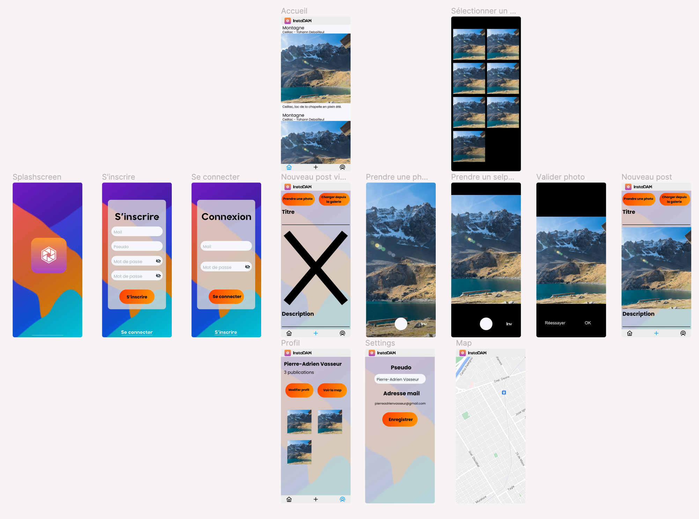

# InstaDAM

InstaDAM is a simple replica of Instagram. It is an android application that allows users to share geolocated photos with the people around them.

## Features

- Login / Register
- Geolocated photos (Camera / Gallery / Map / Geocoder)
- Feed with RecyclerView and Pagination
- Notifications

## Figma

## Notes

- Works on Android API 27 -> 33

Made with ❤️ by 
- [De Seroux Colin](https://github.com/Colin-de-Seroux)
- [Debailleul Yohann](https://github.com/ydbl)
- [Vasseur Pierre-Adrien](https://github.com/Pierrad)
